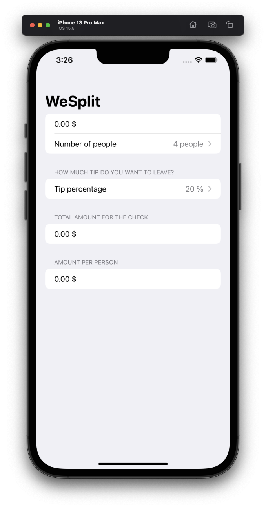
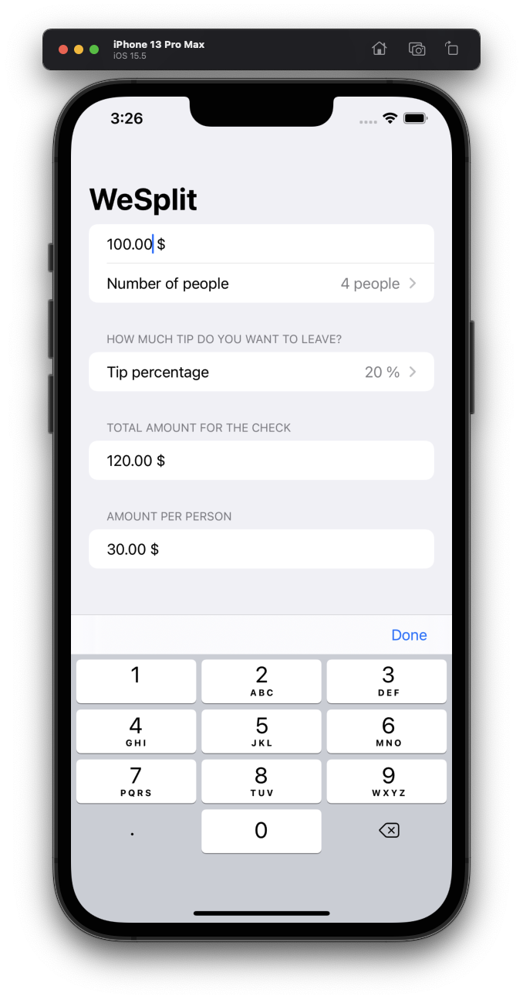
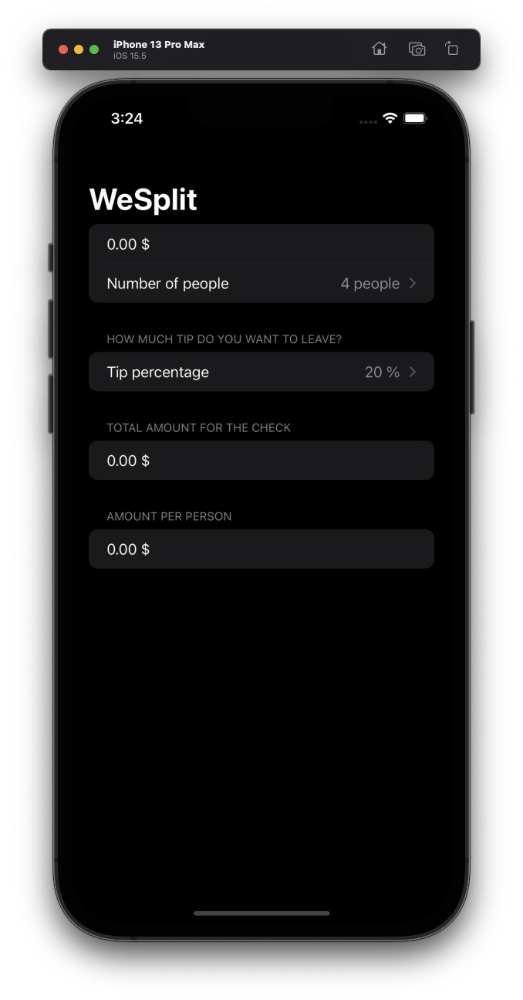
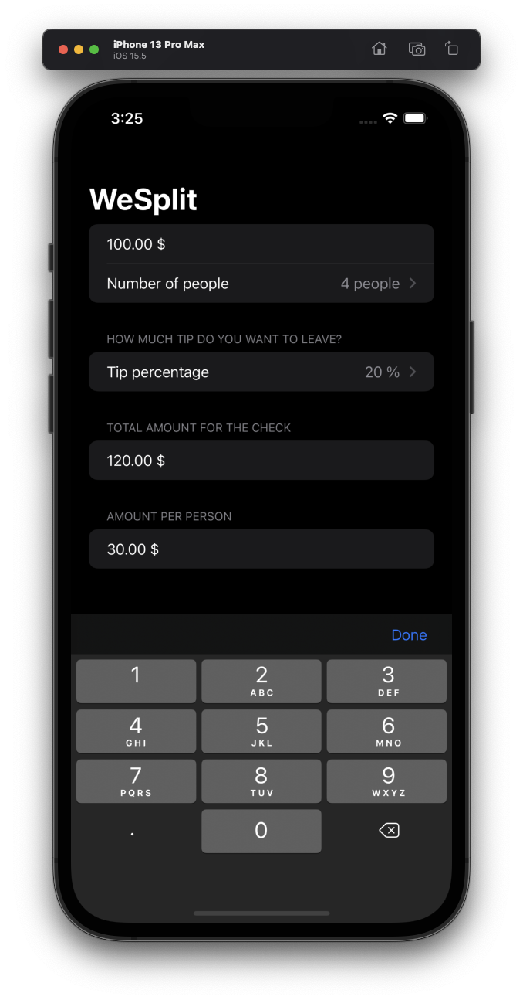

# Project 1 - WeSplit

This project is a check-sharing app that calculates how to split a check based on the number of people and how much tip you want to leave.

## Overview

1. Reading text from the user with TextField.
2. Creating pickers in a form.
3. Adding a segmented control for tip percentages.
4. Calculating the total per person
5. Hiding the keyboard

## Screenshots

### Light Mode

  
  

### Dark Mode

  
  

## Challenge

1. Add a header to the third section, saying “Amount per person”
2. Add another section showing the total amount for the check – i.e., the original amount plus tip value, without dividing by the number of people.
3. Change the tip percentage picker to show a new screen rather than using a segmented control, and give it a wider range of options – everything from 0% to 100%. Tip: use the range 0..<101 for your range rather than a fixed array.
4. Rather than having to type .currency(code: Locale.current.currencyCode ?? "USD") in two places, can you make a new property to store the currency formatter?

## Screenshots

### Light Mode

  
  

### Dark Mode

  
  

