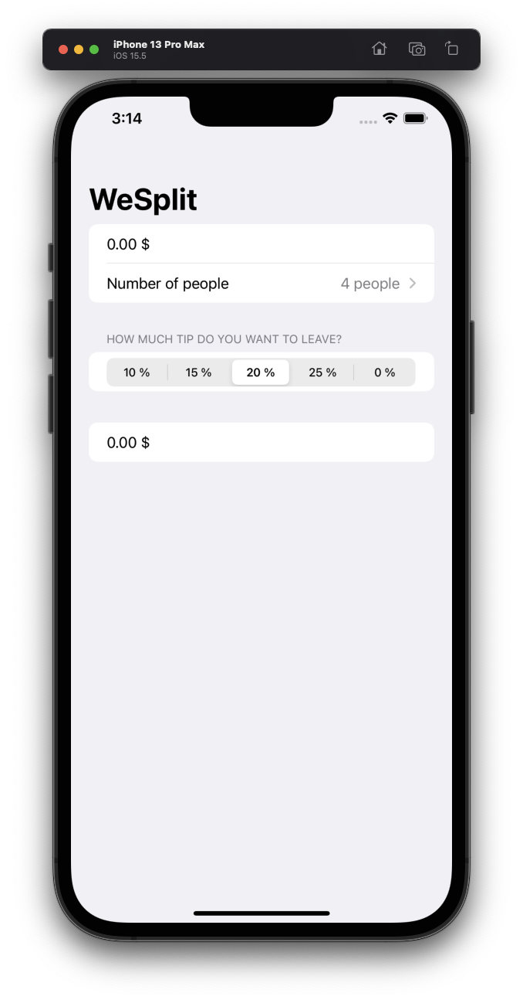
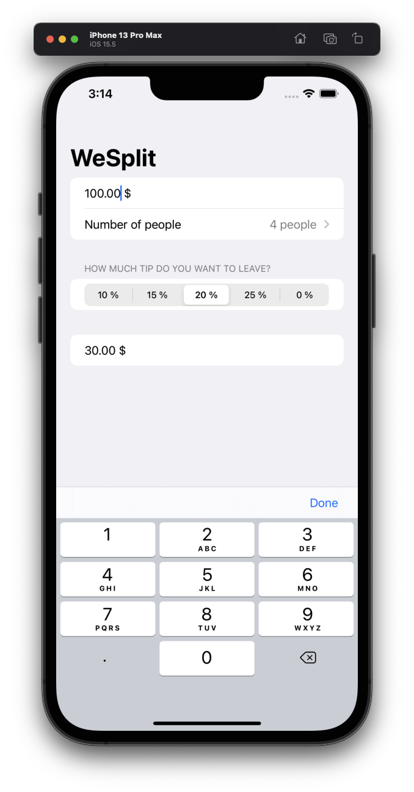
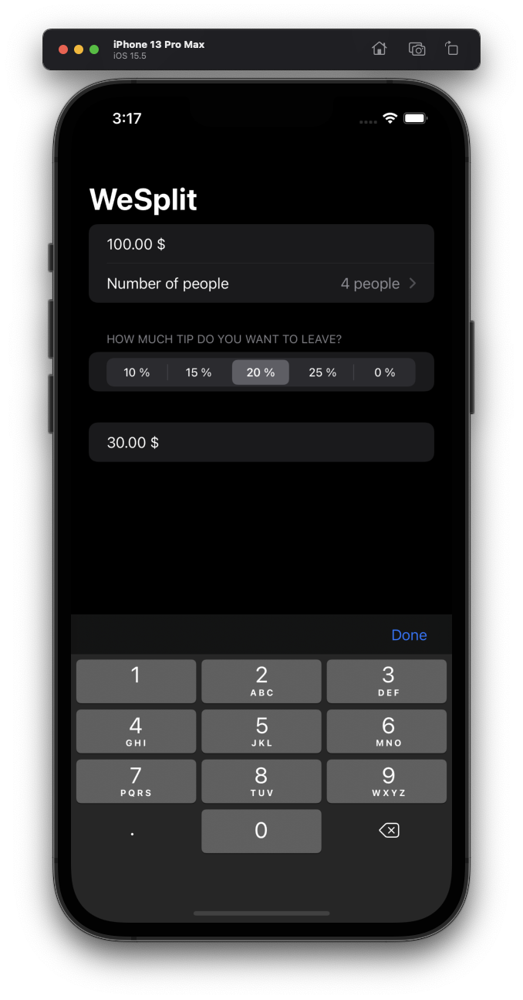
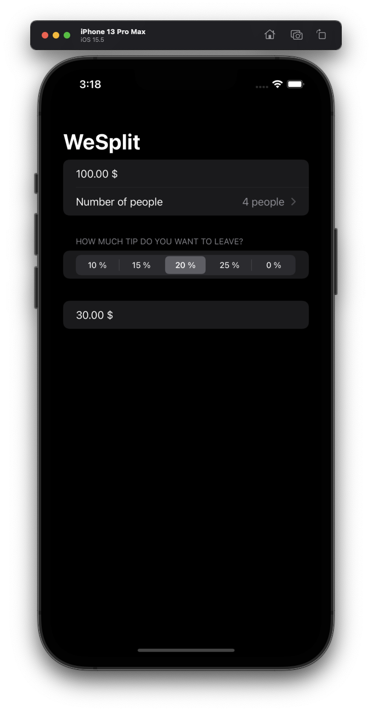

# Project 1 - WeSplit

This project includes solutions to the challenges.

## Overview

1. Add a header to the third section, saying “Amount per person”.
2. Add another section showing the total amount for the check – i.e., the original amount plus tip value, without dividing by the number of people.
3. Change the tip percentage picker to show a new screen rather than using a segmented control, and give it a wider range of options – everything from 0% to 100%. Tip: use the range `0..<101` for your range rather than a fixed array.

## Screenshots

### Light Mode

  
  
  

### Dark Mode

  
  
  

